# OpenShift Container Platform 4.4 on AWS with Microsoft Windows Server 2019/1809 Nodes

**Developer Preview**

This document is tested against a Fedora release 31 Linux host for running all
the Linux commands.

Please note that a command preceded by `>` is to be run in a PowerShell window
on a Windows instance, and a command preceded by `$` is to be run on a Linux
console (localhost).

## Pre-requisites

Complete these prerequisites before proceeding:

1. [Install prerequisite packages](../ocp-4-4-with-windows-server.md#installation-of-prerequisite-packages)
2. [Bring up the OpenShift cluster with ovn-kubernetes](../ocp-4-4-with-windows-server.md#bring-up-the-openshift-cluster-with-ovn-kubernetes)
3. [Configure AWS CLI](https://docs.aws.amazon.com/cli/latest/userguide/cli-chap-configure.html)
4. [Create the install-config](../ocp-4-4-with-windows-server.md#create-the-install-config)
5. [Create manifests](../ocp-4-4-with-windows-server.md#create-manifests)
6. [Configure OVNKubernetes on a Hybrid cluster](../ocp-4-4-with-windows-server.md#configuring-ovnkubernetes-on-a-hybrid-cluster)
7. [Create the cluster](../ocp-4-4-with-windows-server.md#create-the-cluster)
8. [Verify Hybrid networking](../ocp-4-4-with-windows-server.md#verify-hybrid-networking)

## Bring up the Windows node

Launch a *Windows 2019 Server Datacenter with Containers* instance and add it to
the cluster.

### Windows Node Installer

Windows Node Installer (WNI) is an unsupported tool that can automate the
process of launching a Windows instance and prepare it for bootstrapping. For
more details, refer to the
[README](https://github.com/openshift/windows-machine-config-bootstrapper/tree/release-4.4/tools/windows-node-installer).

Download WNI v4.4.3-alpha on your Linux host and ensure you can execute it:

```sh
$ wget https://github.com/openshift/windows-machine-config-bootstrapper/releases/download/v4.4.3-alpha/wni
$ chmod +x wni
```

The following command creates the instance with your AWS account and outputs the
credentials. It expects your credentials to be stored on the system and have the
`aws_access_key_id` and `aws_secret_access_key`.

```sh
$ ./wni aws create --kubeconfig <path_to_openshift_cluster>/auth/kubeconfig --credentials <path_to_aws>/credentials --credential-account <credential_account_in_credentials_file> --instance-type m5a.large --ssh-key <name_of_existing_ssh key> --private-key <path_to_private_key> --dir <directory>
```

For example:

```sh
$ ./wni aws create --kubeconfig ~/<cluster_dir>/auth/kubeconfig --credentials ~/.aws/credentials --credential-account dev --instance-type m5a.large --ssh-key aws-key-name --private-key ~/.ssh/key.pem --dir ./windowsnodeinstaller/
```

The output of this command will give the private and public IP required for
creating the host file in the
[Setup Ansible connection](#setup-ansible-connection) step.

You can now [setup Ansible](#setup-ansible-connection) before moving on to the
next steps.

If the Windows node cannot be brought up due to some reason using the automated
Windows Node Installer (WNI) tool, the Windows node can also be brought up
manually using the steps outlined in the [Appendix](#appendix) section.

#### Setup Ansible connection

Now we can use Ansible to configure the Windows host. On the Linux host, install
`ansible` and `pywinrm`, as well as `selinux-python` bindings:

**Note:** This step assumes that python3 is installed on the system. Ansible
will not work without python.

```sh
$ sudo dnf install python3-libselinux
$ pip install ansible==2.9 pywinrm selinux --user
```

Create a hosts file with the following information:

```
[win]
<public_ip> ansible_password=<password> private_ip=<private_ip>

[win:vars]
ansible_user=<username>
cluster_address=<cluster_address>
ansible_connection=winrm
ansible_ssh_port=5986
ansible_winrm_server_cert_validation=ignore
```

`<cluster_address>` is the cluster endpoint. It is the combination of your
cluster name and the base domain for your cluster.

```sh
$ oc cluster-info | head -n1 | sed 's/.*\/\/api.//g'| sed 's/:.*//g'
```

`<public_ip>` is the IPv4 public ip of the Windows instance from the
[Amazon console](https://console.aws.amazon.com/ec2). Do not use the DNS address
of the instance here.

`<private_ip>` is the private IP of the node and can be found in the output of
the Windows node creation using the automated [WNI](#windows-node-installer)
tool.

`<username>` and `<password>` are the login credentials for the Windows
instance. Note the username listed here must have administrative privileges. By
default, `<username>` is `Administrator`. Here is an example hosts file:

```
[win]
40.69.185.26 ansible_password='mypassword' private_ip=10.0.29.167

[win:vars]
ansible_user=Administrator
cluster_address=winc-cluster.devcluster.openshift.com
ansible_connection=winrm
ansible_ssh_port=5986
ansible_winrm_server_cert_validation=ignore
```

Test if Ansible is able to communicate with the Windows instance with the
following command:

```sh
$ ansible win -i <name_of_the_hosts_file> -m win_ping -v
```

**Note:** If you do not want to provide the password in the hosts file, you can
provide the same as an extra variable to any Ansible command. For example, the
above command could be executed as:

```sh
$ ansible win -i <name_of_the_hosts_file> -m win_ping -v --extra-vars "ansible_password=<password>"
```

## Bootstrap the Windows instance

On a Linux host, run the Ansible Playbook that transfers the necessary files
onto the Windows instance and bootstraps it so that it can join the cluster as a
worker node.

**Note:** Playbook assumes you have `jq` installed. Your active RDP connection
might be disrupted during the execution of the playbook. Make sure you have at
least 600mb of free space in the `/tmp` directory.

Run the Ansible playbook to bootstrap the Windows worker node. Make sure you
have at least 6GB of free space in the `/tmp` directory.

```sh
$ git clone https://github.com/openshift/windows-machine-config-bootstrapper.git
$ git fetch && git checkout release-4.4
$ ansible-playbook -i <path_to_hosts_file> windows-machine-config-bootstrapper/tools/ansible/tasks/wsu/main.yaml -v
```

```sh
$ oc get nodes -l kubernetes.io/os=windows
```

You can now see the Windows instance has joined the cluster

```sh
NAME                           STATUS   ROLES    AGE     VERSION
ip-10-0-71-15.ec2.internal     Ready    worker   3h30m   v1.17.1
```

### API rate limit exceeded error when running WSU

The WSU playbook uses GitHub API to fetch releases for WMCB. You might encounter an
API rate limit exceeded error while running WSU playbook in `TASK [Get
release]`. The issue occurs due to GitHub rate-limiting unauthenticated requests
at 60 requests per hour. As a workaround, wait for the rate-limit to reset (at
most 1 hour) before running the playbook again.

## Test Windows workload

You can now create a pod that can be deployed on a Windows instance. Here is an example
[WebServer](https://gist.githubusercontent.com/suhanime/683ee7b5a2f55c11e3a26a4223170582/raw/d893db98944bf615fccfe73e6e4fb19549a362a5/WinWebServer.yaml)
deployment to create a pod:

**Note:** Given the size of Windows images, it is recommended to pull the Docker
image `mcr.microsoft.com/windows/servercore:ltsc2019` on the instance first,
before creating the pods.

On a Windows instance, run the following command in a PowerShell window:

```pwsh
> docker pull mcr.microsoft.com/windows/servercore:ltsc2019
```

**Note:** Refer to the [RDP section](#rdp-setup) to set up and RDP into your
Windows node.

On the Linux host, deploy the pods:

```sh
$ oc create -f
https://gist.githubusercontent.com/suhanime/683ee7b5a2f55c11e3a26a4223170582/raw/
d893db98944bf615fccfe73e6e4fb19549a362a5/WinWebServer.yaml -n default
```

Once the deployment has been created, we can check the status of the pods:

```sh
$ oc get pods -n default
NAME                             READY   STATUS    RESTARTS   AGE
win-webserver-6f5bdc5b95-x65tq   1/1     Running   0          14m
```

We have created a service of
[LoadBalancer](https://kubernetes.io/docs/concepts/services-networking/service/#loadbalancer)
type:

```sh
$ oc get service win-webserver -n default
NAME          TYPE         CLUSTER-IP    EXTERNAL-IP   PORT(S)        AGE
win-webserver LoadBalancer 172.30.156.18 a22c5338b80f3431bb6428f8a43a4877-890285700.us-east-2.elb.amazonaws.com   80:30897/TCP   33s
```

```sh
$ curl a22c5338b80f3431bb6428f8a43a4877-890285700.us-east-2.elb.amazonaws.com
<html><body><H1>Windows Container Web Server</H1><p>IP 10.132.1.2 callerCount 4 </body></html>
```

### Deploying in a namespace other than default

To deploy into a different namespace, SCC must be disabled in that
namespace. This should never be used in production, and any namespace that this
has been done to should not be used to run Linux pods.

To skip SCC for a namespace, the label `openshift.io/run-level = 1` should be
applied to the namespace. This applies to both Linux and Windows pods, and
thus Linux pods should not be deployed into this namespace.

For example, to create a new project and apply the label, run the following
commands:

```sh
$ oc new-project <project_name>
$ oc label namespace <project_name> "openshift.io/run-level=1"
```

## Appendix

### Bring up the Windows node using the AWS console

1. Log in to the [AWS console](https://console.aws.amazon.com/ec2). Make sure
you are in the same region as your cluster and click on *Running Instances*

    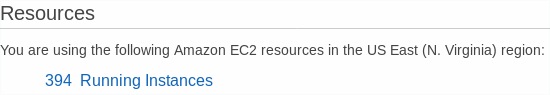

2. Search for the name of your cluster to see the masters and workers running.

3. Select *Launch Instance* to create a new instance:

    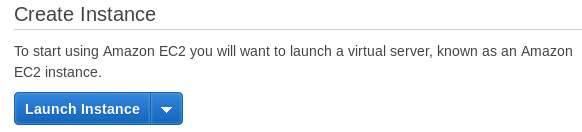

    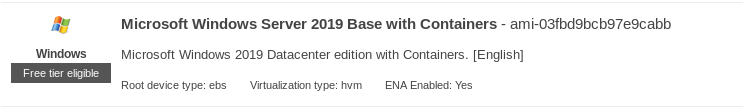

4. Choose the image for *Microsoft Windows Server 2019 Base with Containers*.

5. Select the *m5a.large* Instance Type:

    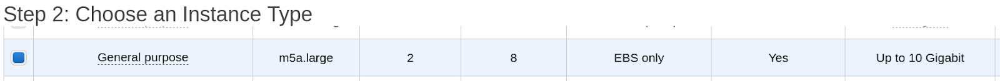

    **Note:** You must use an AMD-based instance.

6. Click *Next: Configure Instance Details* button to configure the details.

    

7. Select the same VPC as your OpenShift cluster (match vpc ID or cluster name): 

    

    Make sure to select *public subnet* or you will not be able to RDP to the
    instance.

8. Enable auto-assigning of the public IP.

    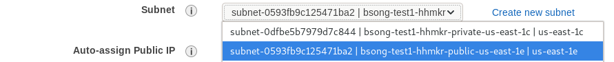

    

9. In the *Tags* section, the cluster tag must be added with the value as
`owned`. You can also name your instance by adding the tag for the same.

    A cluster tag is similar to `kubernetes.io/cluster/<cluster_name>` and can
    be verified in the Tags section of any node in the cluster.

    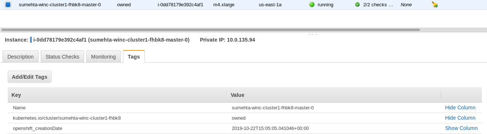

    The resultant tags looks like the following:

    

10. Proceed to the *Configure Security Group* step.

11. Select *MyIP* under source for *RDP* Rule. Then add the *All traffic* rule
and change its source to `Custom 10.0.0.0/16` to allow for cluster
communication. Lastly, open the *WinRM-HTTPS* port for remote management,
enabled for *MyIP*. The configurations should look like this:

    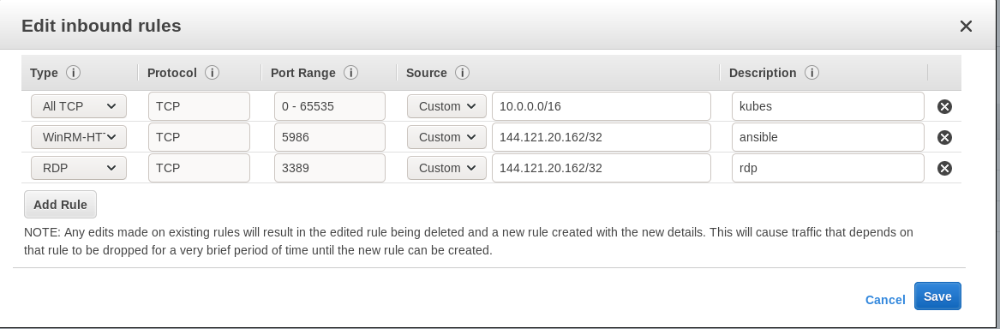

12. Click the *Launch* button on the review page.

    

    It will then show a prompt window to ask for the key pair.

    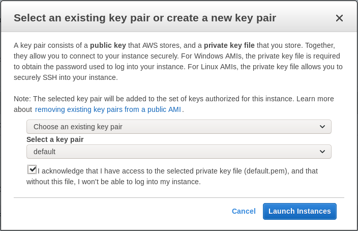

13. Select the key and launch the instance.

    If you already have one key pair on AWS, you can select the one you have.
    Alternatively, you can generate a new key pair by giving it a name and
    storing the `*.pem` file on your local machine by selecting the *Download
    key Pair* button. This is for you to connect to your instance later.

    **Note:** If you are unable to launch an instance due to unavailability of
    instance type within a zone, simply repeat the process, but choose a
    different public subnet.

Navigate to your aws *ec2 instance* using a web browser and find your *instance*
`https://console.aws.amazon.com/ec2/`.

Attach the cluster worker *IAM* and *Security Group* to the Windows node:

1. Select the Windows node instance. Then select *Actions* &rarr; *Instance
Settings* &rarr; *Attach/Replace IAM role*.

    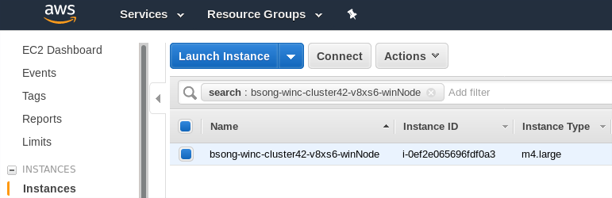

2. Select the IAM role for your cluster's worker profile to attach to your
instance, and choose *Apply*.

    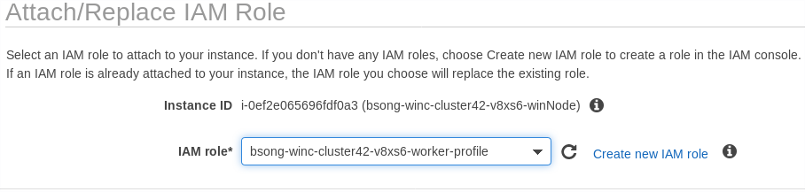

3. Select an OpenShift cluster *worker node* and check the ID of the cluster
   *security group*.

    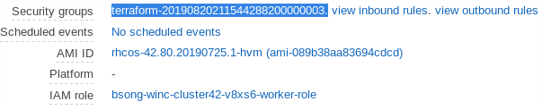

4. Select the Windows node instance again and select *Actions* &rarr;
   *Networking* &rarr; *Change Security Groups*

    

5. You can find the private IP of your node under the Description details of
your Windows node. This is required for creating the host file in the
[Setup Ansible Connection](#setup-ansible-connection) step. Now you can
[setup Ansible](#setup-ansible-connection).

#### RDP Setup

1. Log in to the [AWS console](https://console.aws.amazon.com/ec2). Make sure
you are in the same region as your cluster and click on *Running Instances*

    

2. Search for the name of your cluster to see the masters and workers running.

3. You can now RDP into the instance using the details from the AWS console.
Click the *Connect* button.

    

    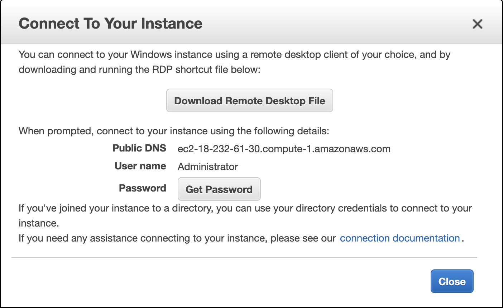

4. Click the *Download Remote Desktop File* to download the remote desktop
application (e.g., `<filename>.rdp`).

5. Click the *Get Password* button and select your `secret.pem` file
(private key of the key-pair you provided to launch the instance) or paste its
content to decrypt the password and use it for the next step:

   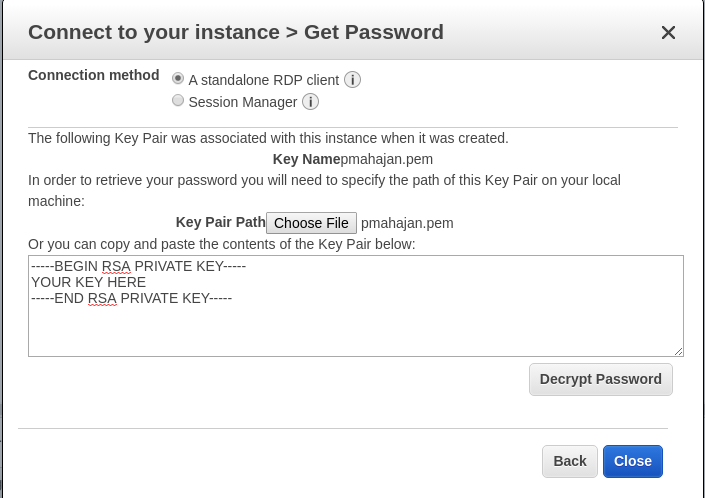

##### Install an RDP tool

For Fedora, we use `freerdp`:

```sh
$ sudo dnf install freerdp
```

You can RDP into the Windows node like this:

```sh
$ xfreerdp <path/to/rdpfile/filename.rdp> /p:'<password>' /f Or
$ xfreerdp /u:Administrator /v:<Public DNS i.e. ec2-3-80-190-235.compute-1.amazonaws.com> /h:1080 /w:1920 /p:'<password>'
```

You can now see a Windows screen display.

#### Setup on Windows instance

##### Enable WinRM

Open a PowerShell window and execute the following commands:

```pwsh
> $url = "https://raw.githubusercontent.com/ansible/ansible/devel/examples/scripts/ConfigureRemotingForAnsible.ps1"
$file = "$env:temp\ConfigureRemotingForAnsible.ps1"
(New-Object -TypeName System.Net.WebClient
```

##### Enable Console logs

Open TCP port 10250 in the Windows Firewall so that logs can be viewed in console and using `oc logs`.

On your Windows instance, execute the following in a PowerShell window:

```pwsh
> New-NetFirewallRule -DisplayName "Enable console logs" -Direction Inbound -Action Allow -Protocol TCP -LocalPort 10250 -EdgeTraversalPolicy Allow
```