# OpenShift Container Platform 4.4 on Azure with Microsoft Windows Server 2019/1809 Nodes

**Developer Preview**

This document is tested against a Fedora release 31 Linux host for running all
the Linux commands.

Please note that a command preceded by `>` is to be run in a PowerShell window
on a Windows instance, and a command preceded by `$` is to be run on a Linux
console (localhost).

## Pre-requisites

Complete these prerequisites before proceeding:

1. [Install prerequisite packages](../ocp-4-4-with-windows-server.md#installation-of-prerequisite-packages)
2. [Bring up the OpenShift cluster with ovn-kubernetes](../ocp-4-4-with-windows-server.md#bring-up-the-openshift-cluster-with-ovn-kubernetes)
3. [Configure Azure CLI](https://docs.microsoft.com/en-us/cli/azure/install-azure-cli?view=azure-cli-latest)
4. [Create a service principal](https://docs.openshift.com/container-platform/4.4/installing/installing_azure/installing-azure-account.html#installation-azure-service-principal_installing-azure-account)
5. [Create the install-config](../ocp-4-4-with-windows-server.md#create-the-install-config)
6. [Create manifests](../ocp-4-4-with-windows-server.md#create-manifests)
7. [Configure OVNKubernetes on a Hybrid cluster](../ocp-4-4-with-windows-server.md#configuring-ovnkubernetes-on-a-hybrid-cluster)
8. [Disable Azure rate limiting](#disable-azure-rate-limiting)
9. [Create the cluster](../ocp-4-4-with-windows-server.md#create-the-cluster)
10. [Verify Hybrid networking](../ocp-4-4-with-windows-server.md#verify-hybrid-networking)

## Bring up the Windows node

Launch a *Windows 2019 Server Datacenter with Containers* instance and add it to
the cluster.

### Windows Node Installer

Windows Node Installer (WNI) is a tool that can automate the process of
launching a Windows instance and prepare it for bootstrapping. For more details,
refer to the
[README](https://github.com/openshift/windows-machine-config-bootstrapper/tree/release-4.4/tools/windows-node-installer).

Download WNI v4.4.3-alpha on your Linux host and ensure you can execute it:

```sh
$ wget https://github.com/openshift/windows-machine-config-bootstrapper/releases/download/v4.4.3-alpha/wni
$ chmod +x wni
```

Azure stores the credentials as a JSON file at `~/.azure/osServicePrincipal.json`
by default. `dir` is an optional argument. The directory path provided should
exist on the system. Default is the current directory. 

The following command creates the instance in your Azure account and stores
credentials for logging into the instance in the directory path:

```sh
$ ./wni azure create --kubeconfig <path_to_openshift_cluster>/auth/kubeconfig --credentials ~/.azure/osServicePrincipal.json --image-id MicrosoftWindowsServer:WindowsServer:2019-Datacenter-with-Containers:latest --instance-type Standard_D2s_v3 --dir <directory>
```

This command outputs the private and public IP required for creating the host
file in the [Setup Ansible connection](#setup-ansible-connection) step.

You can now [setup Ansible](#setup-ansible-connection) before moving on to the
next steps.

If the Windows node cannot be brought up due to some reason using the automated
Windows Node Installer (WNI) tool, the Windows node can also be brought up
manually using the steps outlined in the [Appendix](#appendix) section.

#### Setup Ansible connection

Now we can use Ansible to configure the Windows host. On the Linux host, install
`ansible` and `pywinrm`, as well as `selinux-python` bindings:

**Note:** This step assumes that python3 is installed on the system. Ansible
will not work without python.

```sh
$ sudo dnf install python3-libselinux
$ pip install ansible==2.9 pywinrm selinux --user
```

Create a hosts file with the following information:

```
[win]
<public_ip> ansible_password=<password> private_ip=<private_ip>

[win:vars]
ansible_user=<username>
cluster_address=<cluster_address>
ansible_connection=winrm
ansible_ssh_port=5986
ansible_winrm_server_cert_validation=ignore
```

`<cluster_address>` is the cluster endpoint. It is the combination of your cluster
name and the base domain for your cluster.

```sh
$ oc cluster-info | head -n1 | sed 's/.*\/\/api.//g'| sed 's/:.*//g'
```

`<public_ip>` is the public IP address of the Windows instance and can
be found under <Windows_node_name>-ip (look at the screenshot below).
Please provide the IPv4 public IP here as `<public_ip>`.

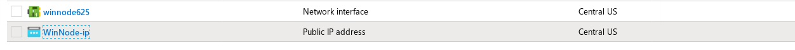

`<private_ip>` is the private IP of the node and can be found in the output of
the Windows node creation using the automated [WNI](#windows-node-installer)
tool.

`<username>` and `<password>` are the login credentials for Windows instance. Note
the username listed here must have administrative privileges.

Here is an example hosts file:

```
[win]
40.69.185.26 ansible_password='mypassword’ private_ip=10.0.32.7

[win:vars]
ansible_user=core
cluster_address=winc-cluster.winc.azure.devcluster.openshift.com
ansible_connection=winrm
ansible_ssh_port=5986
ansible_winrm_server_cert_validation=ignore
```

Test if Ansible is able to communicate with the Windows instance with the
following command:

```sh
$ ansible win -i <name_of_the_hosts_file> -m win_ping -v
```

**Note:** If you do not want to provide the password in the hosts file, you can
provide the same as an extra variable to any ansible command. For example, the
above command could be executed as:

```sh
$ ansible win -i <name_of_the_hosts_file> -m win_ping -v --extra-vars "ansible_password=<password>"
```

### Bootstrap the Windows node

On a Linux host, run the Ansible Playbook that transfers the necessary files
onto the Windows instance and bootstraps it so that it can join the cluster as a
worker node.

**Note:** Playbook assumes you have `jq `installed. Your active RDP connection
might be disrupted during the execution of the playbook.

Clone the GitHub repository to download the Ansible playbook and all the required
dependencies.

```sh
$ git clone https://github.com/openshift/windows-machine-config-bootstrapper.git
$ git fetch && git checkout release-4.4
```

Run the Ansible playbook to bootstrap the windows worker node. Make sure you
have at least 6GB of free space in the `/tmp` directory.

```sh
$ ansible-playbook -i <path_to_hosts_file> windows-machine-config-bootstrapper/tools/ansible/tasks/wsu/main.yaml -v
```

```sh
$ oc get nodes -l kubernetes.io/os=windows
```

You can now see the Windows instance has joined the cluster:

```sh
NAME                                        STATUS   ROLES    AGE     VERSION
winworker-obm7a                             Ready    worker   2m11s   v1.17.1
```

#### API rate limit exceeded error when running WSU
WSU playbook uses GitHub API to fetch releases for WMCB. You might encounter an
API rate limit exceeded error while running WSU playbook in `TASK [Get release]`
and `TASK [Get latest 0.8.x cni plugins version]`. The issue occurs due to
GitHub rate-limiting unauthenticated requests at 60 requests per hour. As a
workaround, wait for the rate-limit to reset (at most 1 hour) before running the
playbook again.

## Test Windows workload

You can now create a pod that can be deployed on a Windows instance. Here is an example
[WebServer](https://gist.githubusercontent.com/suhanime/683ee7b5a2f55c11e3a26a4223170582/raw/d893db98944bf615fccfe73e6e4fb19549a362a5/WinWebServer.yaml)
deployment to create a pod.

**Note:** Given the size of Windows images, it is recommended to pull the Docker
image `mcr.microsoft.com/windows/servercore:ltsc2019` on the instance first,
before creating the pods.

On a Windows instance, run the following command in a PowerShell window:

```pwsh
> docker pull mcr.microsoft.com/windows/servercore:ltsc2019
```

**Note:** Refer [RDP section](#rdp-setup) to set up and RDP into your Windows
node.

On the Linux host, deploy the pods:

```sh
$ oc create -f https://gist.githubusercontent.com/suhanime/683ee7b5a2f55c11e3a26a4223170582/raw/d89 3db98944bf615fccfe73e6e4fb19549a362a5/WinWebServer.yaml -n default
```

Once the deployment has been created, you can check the status of the pods:

```sh
$ oc get pods -n default 
NAME                             READY   STATUS    RESTARTS   AGE
win-webserver-6f5bdc5b95-x65tq   1/1     Running   0          14m
```

You have created a service of
[LoadBalancer](https://kubernetes.io/docs/concepts/services-networking/service/#loadbalancer)
type:

```sh
$ oc get service win-webserver -n default 
NAME            TYPE           CLUSTER-IP    EXTERNAL-IP   PORT(S)        AGE
win-webserver   LoadBalancer   172.30.0.31  20.185.74.192  80:31412/TCP   17m
```

```sh
$ curl 20.185.74.192:80
<html><body><H1>Windows Container Web Server</H1><p>IP 10.132.1.2 callerCount 4 </body></html>
```
### Deploying in a namespace other than default

To deploy into a different namespace, SCC must be disabled in that
namespace. This should never be used in production, and any namespace that this
has been done to should not be used to run Linux pods.

To skip SCC for a namespace, the label `openshift.io/run-level = 1` should be
applied to the namespace. This applies to both Linux and Windows pods, and
thus Linux pods should not be deployed into this namespace.

For example, to create a new project and apply the label, run the following
commands:

```sh
$ oc new-project <project_name>
$ oc label namespace <project_name> "openshift.io/run-level=1"
```

## Appendix

### Bring up the Windows node using the Azure portal

1. Log in to the [Azure portal](https://portal.azure.com/).

2. Navigate to the resource group related to your cluster to see the masters and
workers running.

3. Select *Create a resource* in the left menu:

    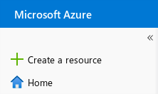

4. Select *Virtual Machine* under Compute:

    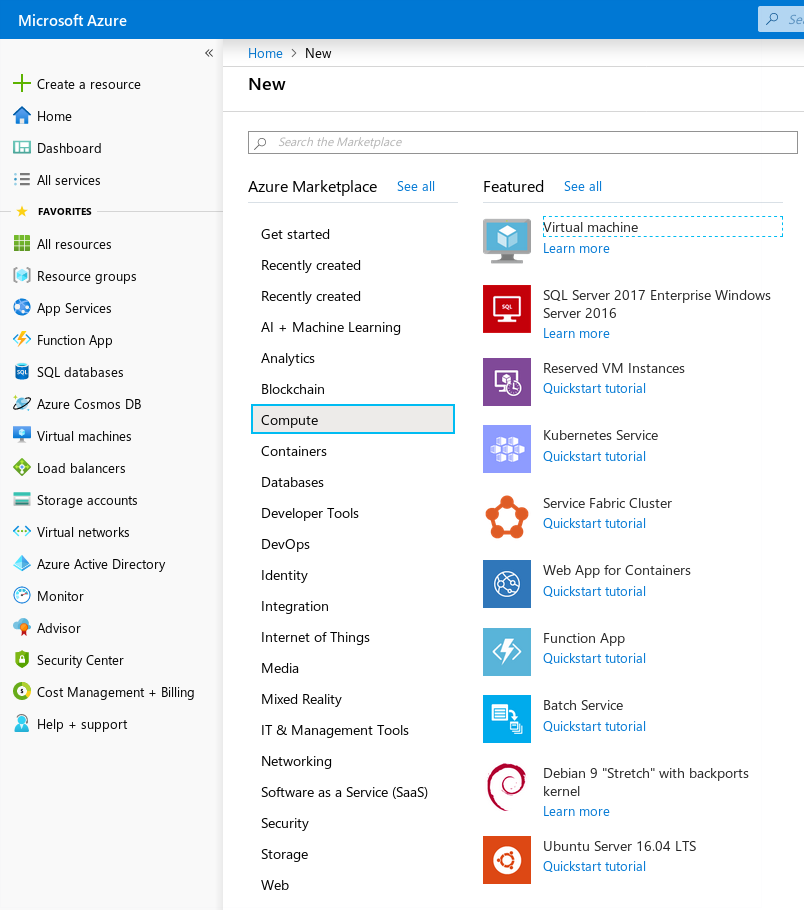

5. Provide your cluster’s resource group and its region as the *Resource Group*
and *Region*. This ensures the instance is created in the same region and is a
part of the OpenShift cluster. The image should be *Windows Server 2019 Datacenter with Containers*
and the size should be *Standard_D2s_v3*.

    **Note:** The image might not be populated in the drop down automatically.

    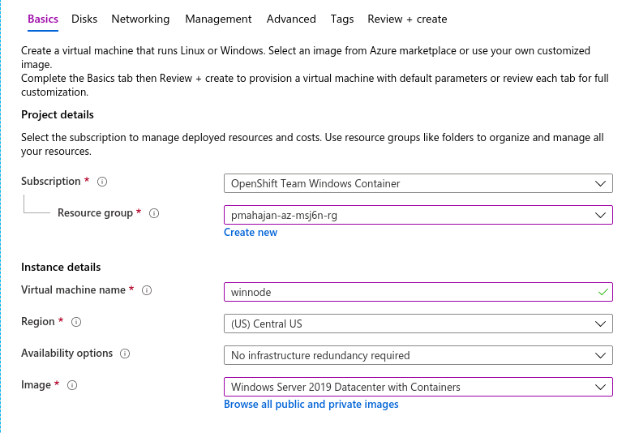

    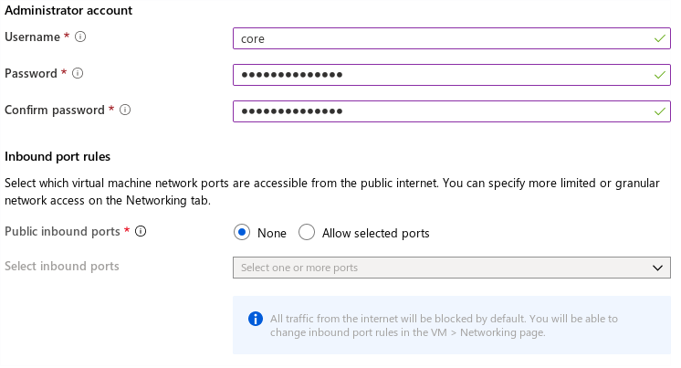

6. In the Networking tab, ensure the Virtual network points to the same
virtual network to which your cluster belongs, and the subnet points to the *worker
subnet* of the cluster. You should also have a public IP created, so you can RDP
into the instance:

    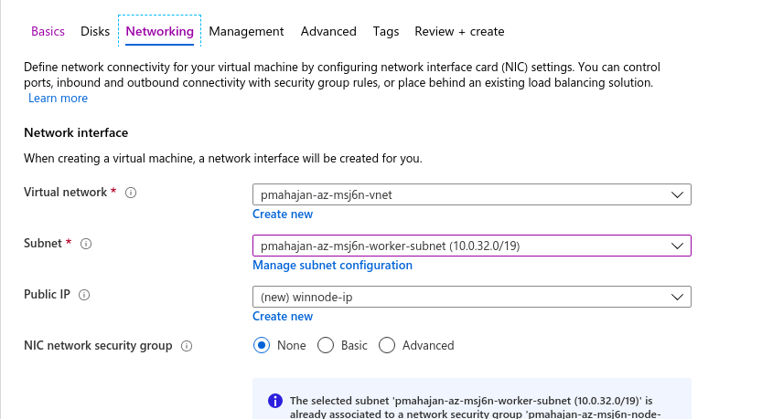

7. In the Load balancing section, enable the load balancer of type *Azure load
balancer* and place the virtual machine behind the same load balancer as other
worker nodes &mdash; a load balancer which is neither the `internal-lb` nor the
`public-lb` as highlighted in the image below.

    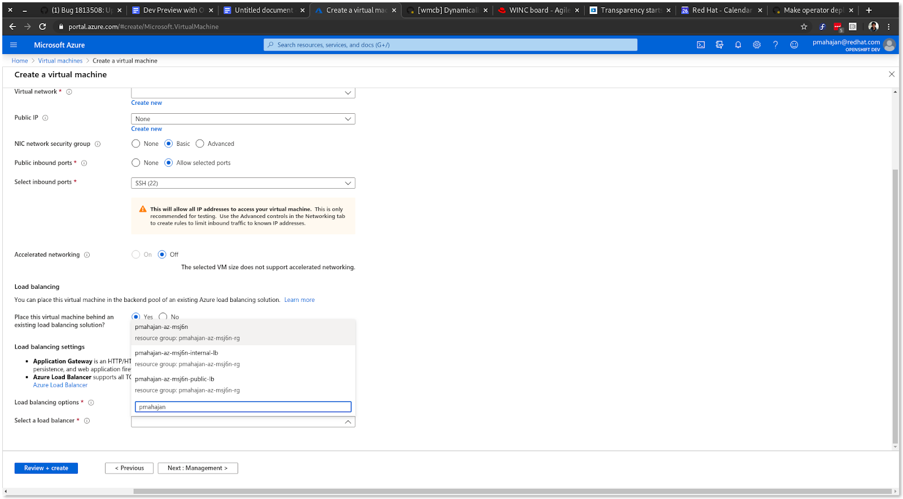

    You might see 3 different load balancers similar to the ones shown in the
    image. Select the load balancer which corresponds to the name of your
    cluster. In the image below, `pmahajan-az-msj6n` is the load balancer that
    needs to be picked up for this example workflow. 

    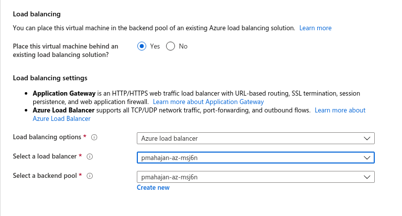

8. Under the Tags section, pick the tag of your cluster and set the value to
`owned`:

    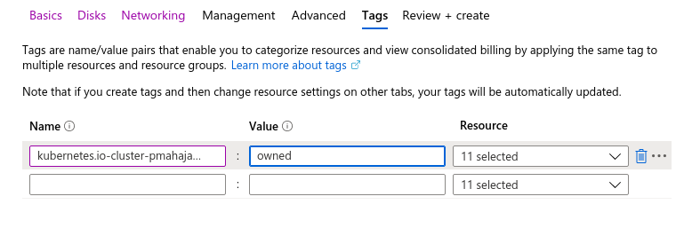

9. Review and create the instance:

    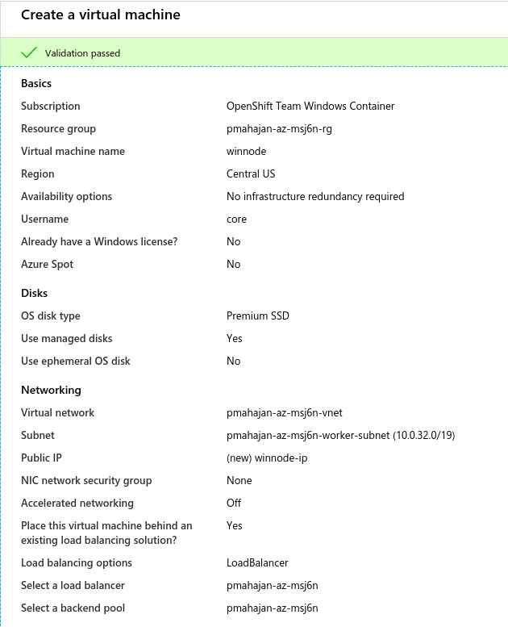

    The portal will notify you when the instance is ready:

    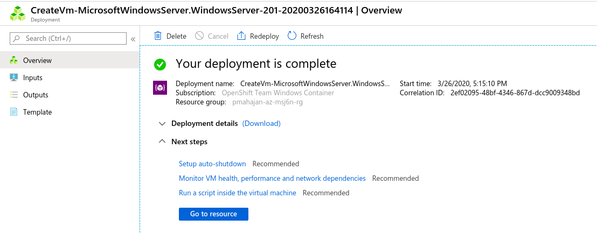

10. Now you must set the security groups that will allow you to RDP to the node.
Under your resource group, find the Network Security Group for the
`<cluster name>-node-nsg`; this is the worker network security group.

    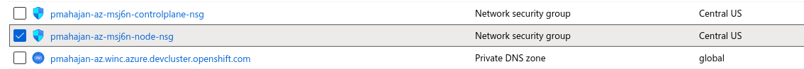

11. Select the *Inbound security rules* on the left panel:

    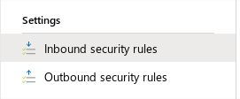

12. Add the following rules that will allow you to RDP into the instance,
remotely manage with Ansible, and open up communications from within the
cluster. The *Source IP* for RDP and WinRM is the public IP address of your
machine followed by `/32`.

    You can get your public IP address by running the following command:

    ```sh
    $ curl ifconfig.co
    ```

    Example security rule to allow access through RDP:

    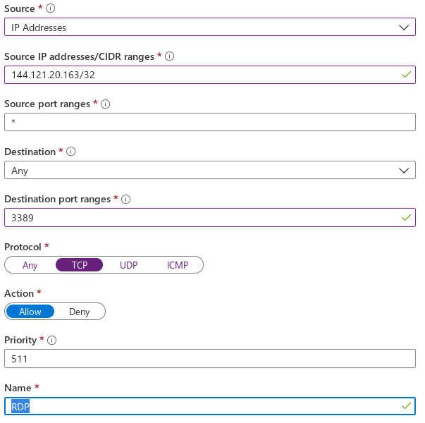

    Example security rule for WinRM:

    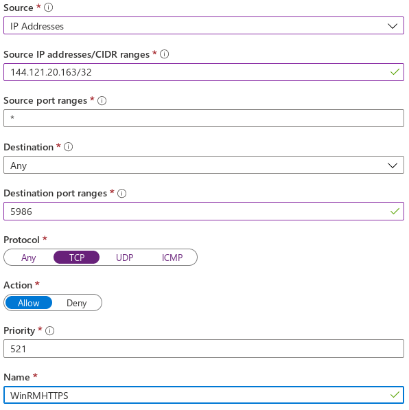

    Example security rule to open up communication within the cluster:

    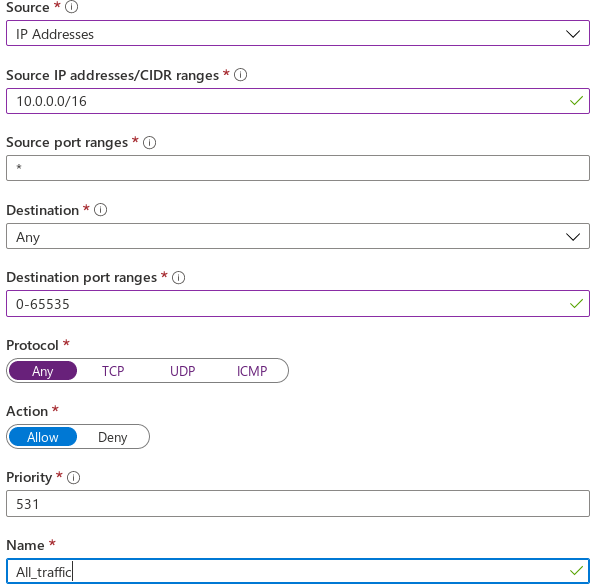

    The final rules should look like the following:

    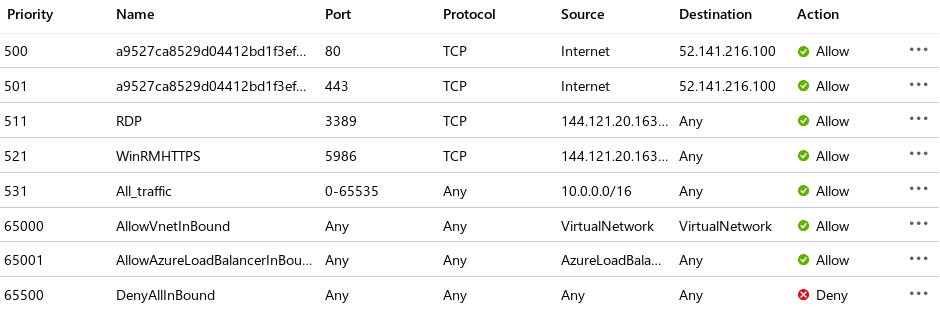

13. Note the private IP of your Windows worker node. This is required
for creating the host file in the [Setup Ansible Connection](#setup-ansible-connection)
step.

    Now you can [setup Ansible](#setup-ansible-connection)

#### RDP Setup

##### Install an RDP tool: 

For Fedora, we use `freerdp`.

```sh
$ sudo dnf install freerdp
```

You can see the public IP by looking at the `<name_of_windows_instance>-ip`
under your resource group.

The user sets up the password while creating the virtual machine. There is no
way to recover this once the machine is created. You can reset the password
through *Azure Portal* &rarr; *Virtual Machine* &rarr; *Settings* &rarr; *Reset
Password*.

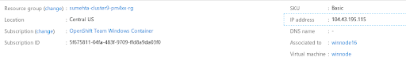

```sh
$ xfreerdp /u:<username of Windows instance> /v:<Public IP of Windows instance> /p:'<password>' /f
```

You can now see a Windows screen display.

#### Setup on Windows instance

##### Enable WinRM

Open a PowerShell window and execute the following commands:

```pwsh
> $url = "https://raw.githubusercontent.com/ansible/ansible/devel/examples/scripts/ConfigureR emotingForAnsible.ps1"
$file = "$env:temp\ConfigureRemotingForAnsible.ps1"
(New-Object -TypeName System.Net.WebClient).DownloadFile($url,  $file)
powershell.exe -ExecutionPolicy ByPass -File $file
```

##### Enable Console logs

Open TCP port 10250 in the Windows Firewall so that logs can be viewed in
console and using `oc logs`.

On your Windows instance, execute the following in a PowerShell window:

```pwsh
> New-NetFirewallRule -DisplayName "Enable console logs" -Direction Inbound -Action Allow -Protocol TCP -LocalPort 10250 -EdgeTraversalPolicy Allow
```

## Reference

### Disable Azure rate limiting

On bringing up the cluster with network type OVNKubernetes, you might encounter
an error related to
[Rate Limiting on Azure API](https://bugzilla.redhat.com/show_bug.cgi?id=1782516)
calls. 

```sh
Error updating load balancer with new hosts map[sumehta-winc8-2tk76-master-0:{}
sumehta-winc8-2tk76-master-1:{} sumehta-winc8-2tk76-master-2:{}
sumehta-winc8-2tk76-worker-centralus1-mmjkr:{} 
sumehta-winc8-2tk76-worker-centralus2-qptsj:{}
sumehta-winc8-2tk76-worker-centralus3-pq5sk:{} winnode:{}]:
ensure(openshift-ingress/router-default):
backendPoolID(/subscriptions/52432811-04323-4342f-92309-ff3452333f0/resourceGroups/sumehta-winc8-2tk76-rg
/providers/Microsoft.Network/loadBalancers/sumehta-winc8-2tk76/backendAddressPools/sumehta-winc8-2tk76)
- failed to ensure host in pool: "azure - cloud provider rate limited(read) for operation:NicGet"
```

As a temporary workaround, you can modify the cloud provider manifests to
disable rate limiting on Azure API calls.

In `manifests/cloud-provider-config.yaml` change the following parameters to
disable rate limiting. 

```yml
"cloudProviderRateLimit": false,
"cloudProviderRateLimitQPS": 0,
"cloudProviderRateLimitBucket": 0,
"cloudProviderRateLimitQPSWrite": 0,
"cloudProviderRateLimitBucketWrite": 0
```

Here is an example of `manifests/cloud-provider-config.yaml` with the changes:

```yml
apiVersion: v1
data:
  config: "{"cloud": "AzurePublicCloud","tenantId": "63544359-b35345d-4353453d-353453e-d534435345534e",
  "aadClientId":
    "",
  "aadClientSecret": "",
  "aadClientCertPath": "",
  "aadClientCertPassword":
    "",
  "useManagedIdentityExtension": true,
  "userAssignedIdentityID":
    "",
  "subscriptionId": "5f343433-04fa-1234-4567-ffd8a354533f0",
  "resourceGroup":
    "pmahajan-az-44bwz-rg",
  "location": "centralus",
  "vnetName": "pmahajan-az-44bwz-vnet",
  "vnetResourceGroup":
    "pmahajan-az-44bwz-rg",
  "subnetName": "pmahajan-az-44bwz-worker-subnet",
  "securityGroupName":
    "pmahajan-az-44bwz-node-nsg",
  "routeTableName": "pmahajan-az-44bwz-node-routetable",
  "primaryAvailabilitySetName":
    "",
  "vmType": "",
  "primaryScaleSetName": "",
  "cloudProviderBackoff":
    true,
  "cloudProviderBackoffRetries": 0,
  "cloudProviderBackoffExponent":
    0,
  "cloudProviderBackoffDuration": 6,
  "cloudProviderBackoffJitter":
    0,
  "cloudProviderRateLimit": false,
  "cloudProviderRateLimitQPS": 0,
  "cloudProviderRateLimitBucket":
    0,
  "cloudProviderRateLimitQPSWrite": 0,
  "cloudProviderRateLimitBucketWrite":
    0,
  "useInstanceMetadata": true,
  "loadBalancerSku": "standard",
  "excludeMasterFromStandardLB":
    null,
  "disableOutboundSNAT": null,
  "maximumLoadBalancerRuleCount": 0
}
"
kind: ConfigMap
metadata:
  creationTimestamp: null
  name: cloud-provider-config
  namespace: openshift-config
```
